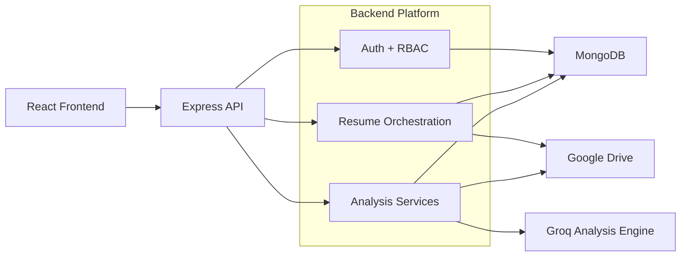

# ATSify Backend

ATSify Backend is the system-of-record for authentication, resume storage orchestration, job request persistence, AI-powered resume analysis, and admin operations. It exposes a protected REST API to the frontend, keeps resume assets private behind backend-controlled streams, and persists operational metadata in MongoDB.

## Executive Summary

- Authentication uses JWT access tokens plus an `httpOnly` refresh cookie.
- Resume binaries are uploaded to Google Drive, while MongoDB stores ownership and lookup metadata.
- Job requests create the business context used for ATS analysis.
- Every analysis run is saved as a historical snapshot, which supports both latest-result and exact-history retrieval.
- Admin APIs provide usage metrics, user visibility, and role management.

## Documentation Map

| Document | Primary Audience | Purpose |
|---|---|---|
| `docs/architecture.md` | CTO, engineering leads, senior ICs | System design, component responsibilities, data flow, and operational boundaries |
| `docs/README.md` | Everyone | Central documentation hub and recommended reading order |
| `docs/api/README.md` | Backend, frontend, QA, PM | API landscape, conventions, dependency map, and endpoint navigation |
| `docs/api/auth.md` | Frontend, backend, QA | Session lifecycle, token model, and auth contracts |
| `docs/api/resume.md` | Backend, frontend, QA | Resume upload, storage, proxy streaming, and file access rules |
| `docs/api/job-request.md` | Backend, frontend, QA, PM | Job request lifecycle, pagination, and business context rules |
| `docs/api/analysis.md` | Backend, frontend, QA, PM | Analysis generation, retrieval patterns, and history model |
| `docs/api/admin-rbac.md` | Engineering leads, security, QA | Admin-only capabilities and RBAC behavior |
| `docs/google-drive-integration.md` | Backend, DevOps, CTO | Google Drive storage model, folder strategy, and file retrieval pattern |
| `docs/security.md` | Engineering, security, leadership | Security model, access boundaries, and hardening guidance |
| `docs/operations.md` | Backend, DevOps, release owners | Runtime requirements, environment setup, and release readiness |
| `docs/testing-guide.md` | Backend, QA | Test strategy, mocked boundaries, and release gates |

## Service Responsibilities



## Runtime Overview

- API framework: Express 5 with TypeScript
- Database: MongoDB via Mongoose
- File storage: Google Drive API
- Auth: JWT access tokens + persisted refresh token cookie
- AI analysis: Groq model through the AI SDK
- Validation: Zod
- Testing: Vitest, Supertest, mongodb-memory-server

## Quick Start

```powershell
npm install
npm run dev
```

Build:

```powershell
npm run build
```

Test:

```powershell
npm test
```

## Required Environment Variables

- `MONGODB_URI`
- `JWT_ACCESS_SECRET`
- `JWT_REFRESH_SECRET`
- `SALT_ROUND`
- `GOOGLE_DRIVE_CLIENT_ID`
- `GOOGLE_DRIVE_CLIENT_SECRET`
- `GOOGLE_DRIVE_REFRESH_TOKEN`
- `GOOGLE_DRIVE_BASE_FOLDER_ID`

Optional:

- `GOOGLE_DRIVE_REDIRECT_URI`
- `NODE_ENV`

## API Surface

| Base Path | Area |
|---|---|
| `/api/v1/auth` | Sign-up, login, refresh, logout |
| `/api/v1/resume` | Resume upload, listing, metadata, PDF/image streaming |
| `/api/v1/job-requests` | Create and read user job requests |
| `/api/v1/analysis` | Generate ATS analysis and retrieve history |
| `/api/v1/admin` | Dashboard stats, user listing, role changes |

## Production Characteristics

- Resume files are not exposed as public URLs.
- File access is always mediated by authenticated backend routes.
- Google Drive credentials remain server-side only.
- Analysis history is immutable from the product point of view: each run is stored as a separate record.
- Admin capabilities are enforced by backend role checks, not by frontend visibility alone.

## Current Implementation Notes

- The API uses more than one response envelope style across modules. This is documented explicitly in `docs/api/README.md` so frontend and QA teams can integrate safely with the current implementation.
- Resume upload uses temporary OS storage during PDF-to-image conversion, then removes the temp directory after processing.
- The current CORS configuration is hard-coded for local frontend development in `src/app.ts`; production deployment should externalize this.
