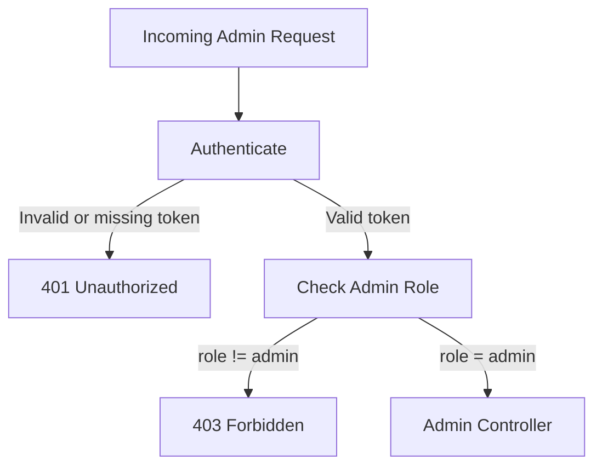
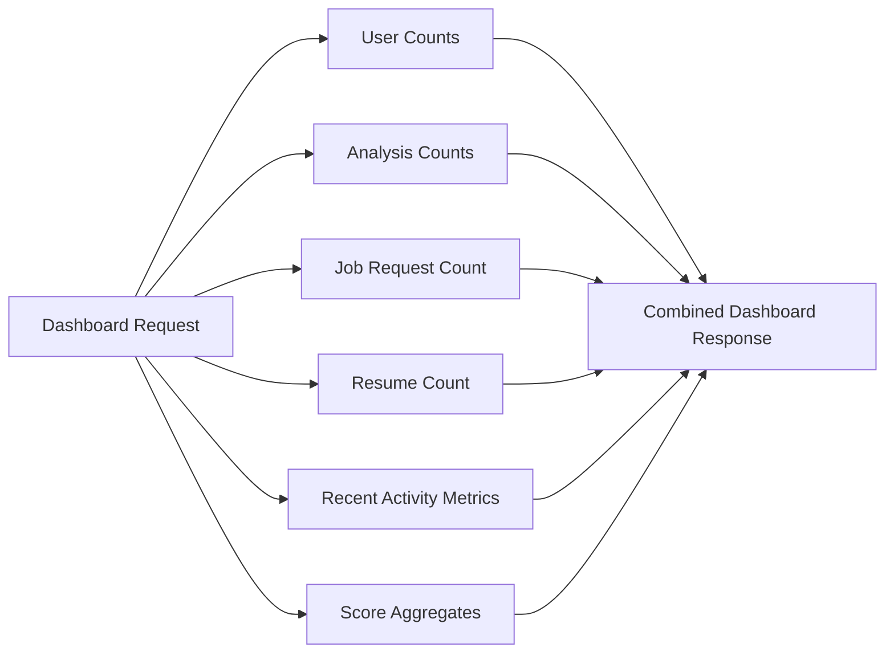
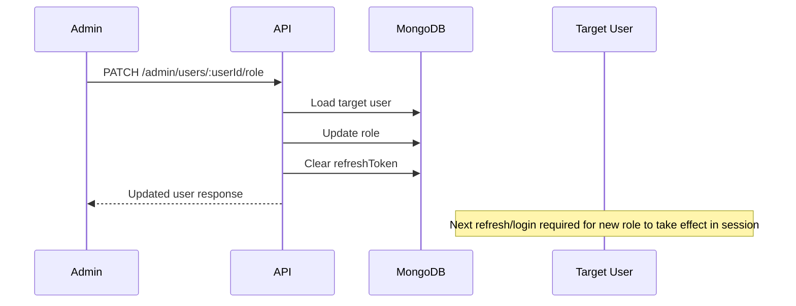

# Admin and RBAC API

Back to index: `./README.md`

Base path: `/api/v1/admin`

## Purpose

The admin module gives authorized operators a controlled view into platform health and user activity. It also provides the only supported path for changing user roles.

## Access Control Model

All admin routes run behind:

1. `authenticate`
2. `requireAdmin`

Only users with `role = "admin"` can proceed.



## Admin Capabilities

| Capability | Endpoint | Outcome |
|---|---|---|
| Dashboard metrics | `GET /dashboard/stats` | Platform-level totals and score summary |
| User listing | `GET /users` | Paginated user list enriched with activity counts |
| Role updates | `PATCH /users/:userId/role` | Promote or demote a user |

## Contract Summary

| Concern | Current behavior |
|---|---|
| Required auth | Bearer token |
| Required role | `admin` |
| User list pagination | Page-based |
| Default list limit | 10 |
| Maximum list limit | 50 |
| Role update side effect | Stored refresh token cleared |

## `GET /dashboard/stats`

Returns a platform summary derived from MongoDB aggregates and counts.

Current response data includes:

- `totalUsers`
- `totalAdmins`
- `totalAnalyses`
- `totalJobRequests`
- `totalResumes`
- `analysesLast7Days`
- `newUsersLast30Days`
- `averageOverallScore`
- `highestOverallScore`

Example response:

```json
{
  "success": true,
  "message": "Admin dashboard stats fetched successfully",
  "data": {
    "totalUsers": 124,
    "totalAdmins": 3,
    "totalAnalyses": 912,
    "totalJobRequests": 401,
    "totalResumes": 287,
    "analysesLast7Days": 73,
    "newUsersLast30Days": 29,
    "averageOverallScore": 67.4,
    "highestOverallScore": 96
  }
}
```

## Metrics Aggregation View



## `GET /users`

Returns a paginated user list with activity counts from related collections.

Query parameters:

- `page`: default `1`
- `limit`: default `10`, capped at `50`

Each user record excludes:

- `password`
- `refreshToken`

Each user record is enriched with:

- `analysisCount`
- `jobRequestCount`
- `resumeCount`

The response also includes:

- `page`
- `limit`
- `totalUsers`
- `totalPages`
- `hasNextPage`
- `hasPreviousPage`

## `PATCH /users/:userId/role`

Request body:

```json
{
  "role": "admin"
}
```

Allowed values:

- `user`
- `admin`

Behavior:

1. Finds the target user by id.
2. Updates the role.
3. Clears the stored refresh token.
4. Saves the user.
5. Returns a sanitized user payload.

Why the refresh token is cleared:

- existing sessions should not silently keep outdated privileges
- the user must re-authenticate and receive a token with the new role claim

## Role Change Flow



## Security Notes

- Admin authorization is enforced server-side only.
- Role changes are security-sensitive operations.
- Sanitized responses avoid returning password and refresh token data.
- Non-admin users receive `403 Forbidden` even with a valid access token.

## Response and Failure Matrix

| Endpoint | Success | Common failures |
|---|---|---|
| `GET /dashboard/stats` | `200` | `401`, `403`, `500` |
| `GET /users` | `200` | `401`, `403`, `500` |
| `PATCH /users/:userId/role` | `200` | `400`, `401`, `403`, `500` |

## QA Notes

Current integration coverage verifies:

- unauthenticated access is blocked with `401`
- authenticated non-admin access is blocked with `403`
- authenticated admin access returns dashboard metrics
