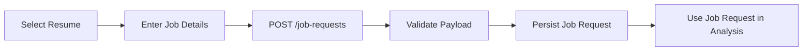
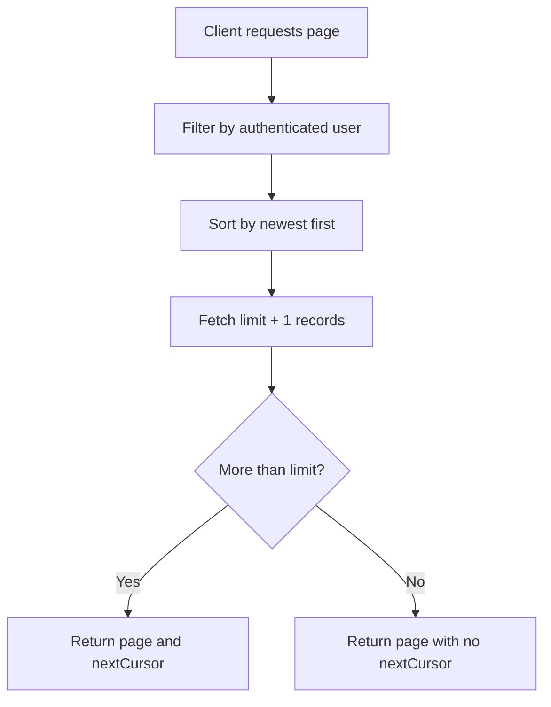

# Job Request API

Back to index: `./README.md`

Base path: `/api/v1/job-requests`

## Purpose

Job requests capture the hiring context against which a resume will be analyzed. Each job request binds a user, a selected resume, and a specific job description into a reusable product artifact.

## Business Role in the Product

Without a job request, the platform has no target role to compare against. This module is the bridge between stored resumes and the analysis engine.

## Lifecycle



## Data Model

Each job request stores:

- `userId`
- `resumeId`
- `companyName`
- `jobTitle`
- `jobDescription`
- timestamps

The collection also has an index on:

- `{ userId: 1, _id: -1 }`

This supports efficient reverse-chronological pagination by user.

## Endpoints

| Method | Path | Description |
|---|---|---|
| `POST` | `/` | Create a new job request |
| `GET` | `/` | List the current user's job requests |
| `GET` | `/:id` | Fetch one job request in user scope |

All job request routes require authentication.

## Contract Summary

| Concern | Current behavior |
|---|---|
| Auth model | Bearer token required |
| Pagination style | Cursor-based |
| Default limit | 10 |
| Allowed limit range | 1 to 100 |
| Ownership model | Authenticated user enforced server-side |

## `POST /`

Request body:

```json
{
  "resumeId": "507f191e810c19729de860ea",
  "companyName": "Acme Corp",
  "jobTitle": "Backend Engineer",
  "jobDescription": "Need a backend engineer with Node.js and MongoDB experience."
}
```

Validation rules:

- `resumeId` is required
- `companyName` length: `1-200`
- `jobTitle` length: `1-200`
- `jobDescription` length: `1-5000`

Important implementation detail:

- If a `userId` is sent in the request body, the controller removes it and replaces it with the authenticated user id.

Success response:

```json
{
  "statusCode": 201,
  "data": {
    "_id": "65f...",
    "userId": "65e...",
    "resumeId": "507f191e810c19729de860ea",
    "companyName": "Acme Corp",
    "jobTitle": "Backend Engineer",
    "jobDescription": "Need a backend engineer with Node.js and MongoDB experience."
  },
  "message": "Job Request created successfully"
}
```

## `GET /`

Lists the authenticated user's job requests using cursor-based pagination.

Query parameters:

- `cursor`: optional MongoDB `_id` cursor
- `limit`: optional item count, clamped between `1` and `100`

Success response:

```json
{
  "statusCode": 200,
  "data": {
    "jobRequests": [],
    "pagination": {
      "nextCursor": null,
      "hasMore": false,
      "limit": 10
    }
  },
  "message": "Fetched User Job Requests"
}
```

## Pagination Flow



## `GET /:id`

Returns a single job request if and only if it belongs to the authenticated user.

Not found behavior:

- `404` with `Job request not found` if the id does not exist or does not belong to the caller

## Ownership and Data Integrity

- Job requests are always stored with the authenticated `userId`.
- Read operations are user-scoped.
- The module is designed to prevent client-side impersonation by ignoring any incoming `userId` value.

## Response and Failure Matrix

| Endpoint | Success | Common failures |
|---|---|---|
| `POST /` | `201` | `400` validation failure, `401` unauthorized |
| `GET /` | `200` | `401` unauthorized |
| `GET /:id` | `200` | `401` unauthorized, `404` not found |

## Product Notes

Job requests are later used by:

- `POST /analysis/analyze`
- `GET /analysis/job-request/:jobRequestId/latest`
- historical analysis records

This makes them a durable business object rather than a transient form submission.
