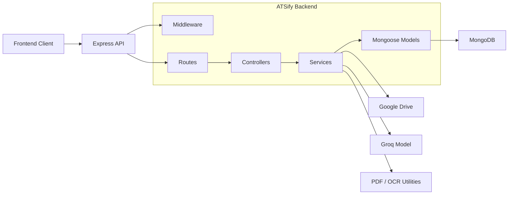
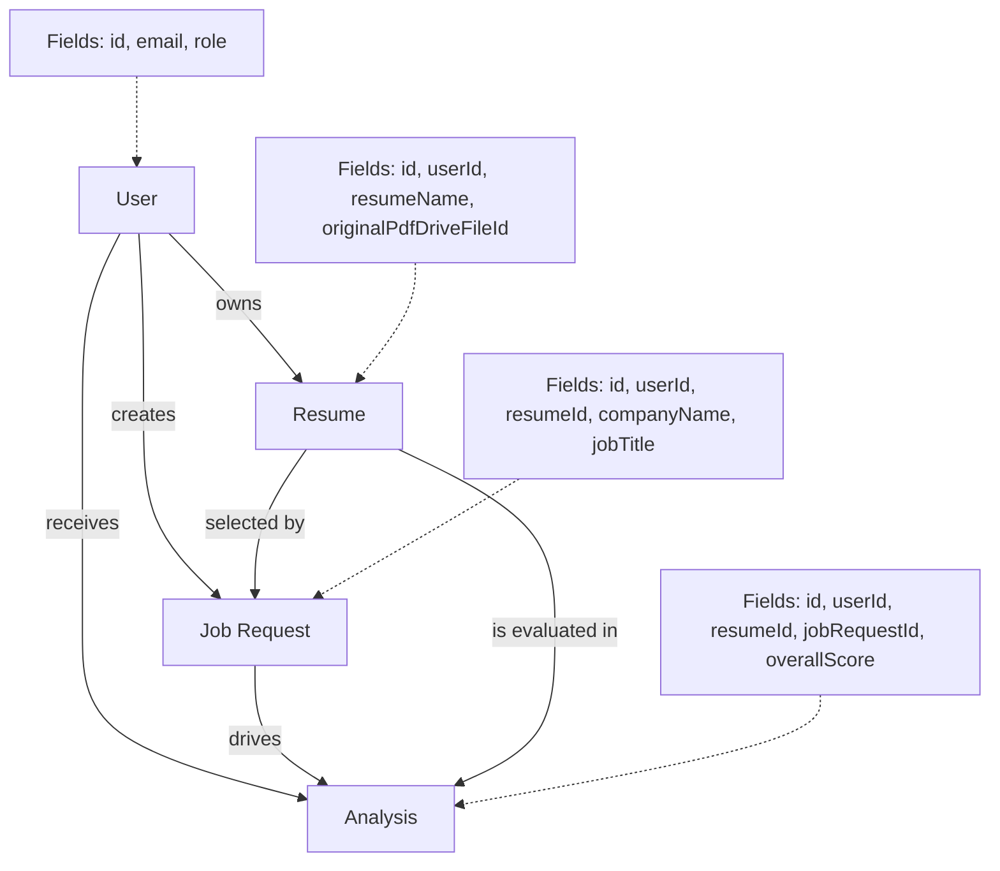
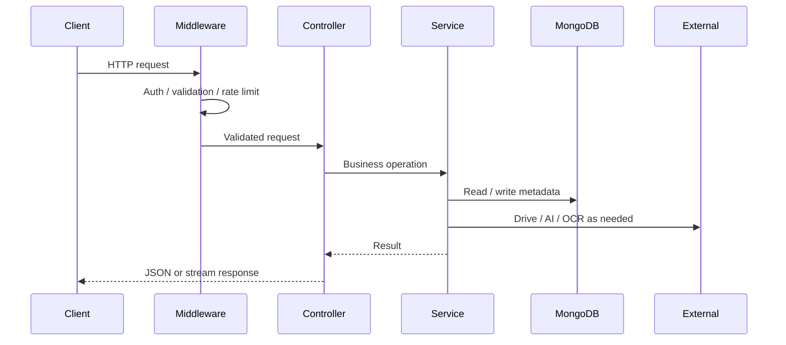
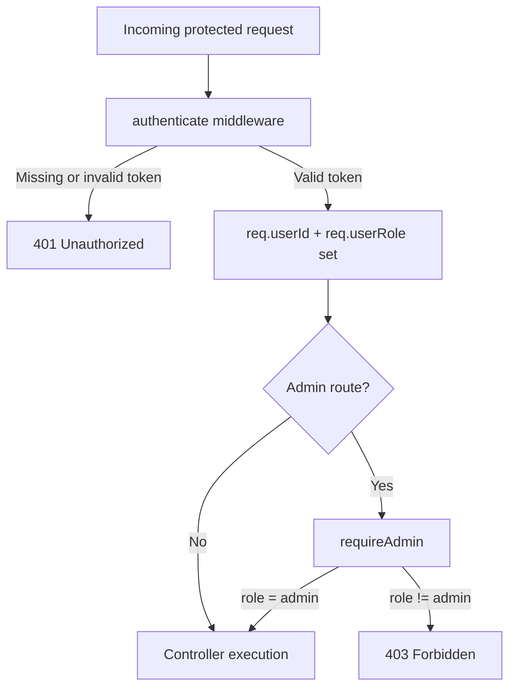
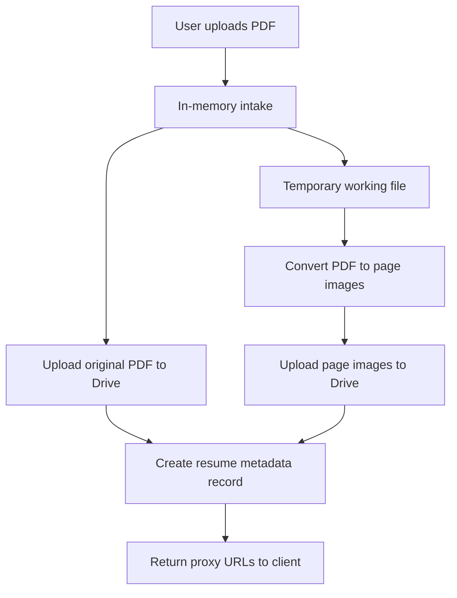
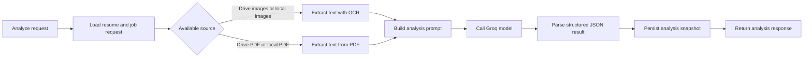
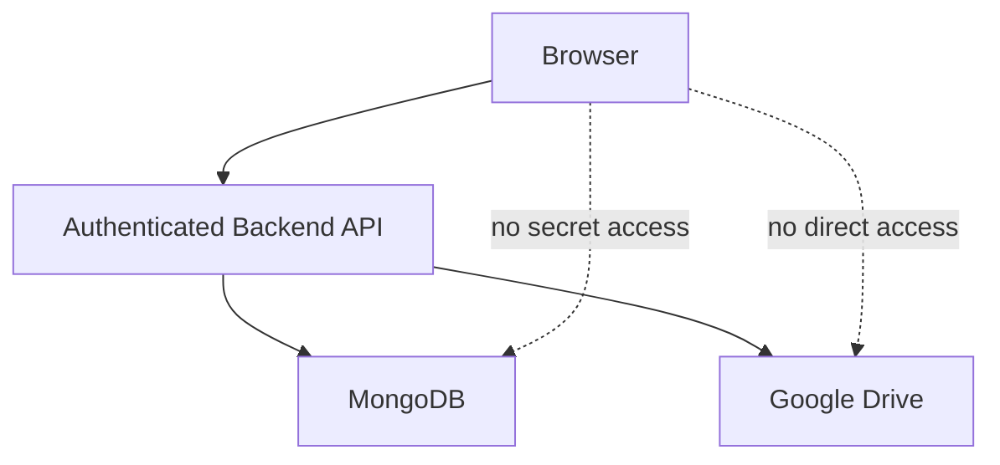

# ATSify Backend Architecture

This document explains how the ATSify backend is organized, how data moves through the platform, and which design choices matter most for engineering leadership, product stakeholders, and future contributors.

## System Intent

The backend exists to solve five platform problems:

1. Authenticate users and maintain secure sessions.
2. Store resumes privately without exposing storage credentials to the browser.
3. Persist job requests as the analysis context.
4. Generate and retain ATS analysis history.
5. Provide admin-only operational visibility and user management.

## Architecture at a Glance

## Responsibility Breakdown

| Layer | Responsibility | Representative Files |
|---|---|---|
| App wiring | Middleware, route mounting, global error handling | `src/app.ts` |
| Routes | Endpoint definitions and middleware composition | `src/routes/*.ts` |
| Controllers | HTTP request orchestration and response shaping | `src/controllers/*.ts` |
| Services | Business logic, persistence orchestration, external integrations | `src/services/*.ts` |
| Models | MongoDB document schemas | `src/models/*.ts` |
| Middleware | Auth, validation, error handling, rate limiting | `src/middleware/*.ts` |
| Utilities | Logging, OCR, PDF extraction, upload helper, API helpers | `src/utils/*.ts` |

## Primary Domain Entities

## Request Lifecycle

## Authentication and Authorization

The platform uses two separate credential types:

- Access token: short-lived JWT sent in `Authorization: Bearer <token>`
- Refresh token: long-lived `httpOnly` cookie stored in MongoDB and used to mint a new access token

Role-based authorization is currently simple and explicit:

- `user` can access user-scoped business routes
- `admin` can access admin routes through `requireAdmin`

## Resume Storage Architecture

Resume storage is intentionally split:

- MongoDB stores ownership, metadata, and Drive file identifiers.
- Google Drive stores the original PDF and generated page images.
- Backend streaming endpoints hide Drive internals from the client.

## Analysis Architecture

Analysis is a multi-stage orchestration pipeline:

## API Boundary Decisions

| Decision | Why it matters |
|---|---|
| Backend-owned file streaming | Prevents the browser from receiving raw Drive credentials or direct Drive URLs |
| Refresh token stored in DB | Allows refresh token invalidation on logout and role change |
| Historical analysis persistence | Supports auditability, product history views, and exact replay of past results |
| User-scoped queries in controllers/services | Reduces accidental data leakage across tenants |
| Admin RBAC handled in middleware | Keeps authorization explicit and consistent |

## Operational Dependencies

| Dependency | Used For | Failure Impact |
|---|---|---|
| MongoDB | Users, resumes, job requests, analyses | Core platform unavailable |
| Google Drive API | Resume PDF and image storage / retrieval | Upload and file streaming unavailable |
| Groq model | ATS analysis generation | Analysis endpoint degraded or unavailable |
| OCR / PDF tooling | Text extraction from resumes | Analysis quality or availability degraded |

## Security Boundary

## Known Architectural Constraints

- CORS origin is currently hard-coded for local development.
- API response envelopes are not fully standardized across all modules.
- Resume upload processing performs PDF conversion synchronously inside the request path, which may become a scale bottleneck for larger files or higher concurrency.
- The analysis service trusts overall flow ownership assumptions; future hardening could enforce ownership again at service level.

## Recommended Next Evolution

1. Move long-running resume processing and analysis into background jobs.
2. Standardize response envelopes across every module.
3. Externalize CORS, cookie, and frontend-origin configuration.
4. Add stronger audit logging for admin actions.
5. Introduce storage abstraction so Drive can be replaced without controller changes.
