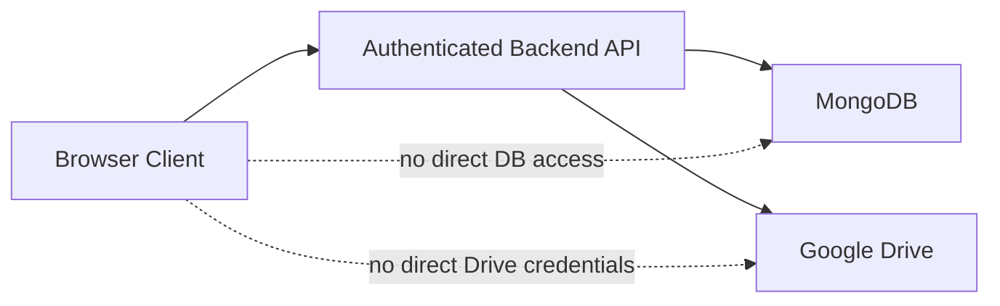
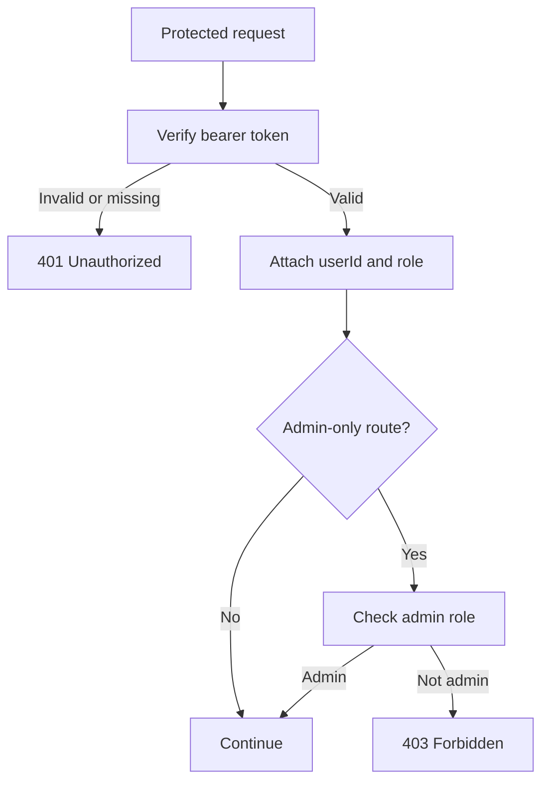

# ATSify Backend Security Model

This document explains how the backend protects identities, resume files, admin capabilities, and cross-user data boundaries.

## Security Objectives

The backend is designed to enforce these security goals:

1. Only authenticated users can access protected business data.
2. Users can only access their own resumes, job requests, and analysis records.
3. Resume files remain private and are not exposed as public cloud-storage links.
4. Admin capabilities are enforced server-side through role checks.
5. Session renewal is controlled through backend-issued refresh tokens.

## Security Boundary



## Authentication Controls

The backend uses two credential types:

- Access token: a short-lived JWT used for protected API routes
- Refresh token: a long-lived `httpOnly` cookie persisted on the user record

Security characteristics:

- Access tokens expire after 15 minutes.
- Refresh tokens expire after 7 days.
- Refresh tokens are stored server-side and can be revoked.
- Refresh tokens are not readable from browser JavaScript.

## Authorization Controls

Protected business routes require:

- `authenticate`

Admin-only routes require:

- `authenticate`
- `requireAdmin`

The access token payload includes the user role, which is checked in middleware before controller execution.



## Data Ownership Model

The backend uses user-scoped lookups throughout the API:

- resumes are looked up by `_id` and `userId`
- job requests are created and read in authenticated user scope
- analysis history is queried by `userId`
- specific analysis records are queried by `analysisId` and `userId`

This is the primary control that prevents cross-tenant data exposure.

## Resume File Protection

Resume files are stored in Google Drive but accessed through backend proxy routes. The browser does not receive Google Drive OAuth credentials, and the frontend does not directly fetch resume assets from Drive.

Protection steps:

1. The user calls a protected backend route.
2. The backend verifies the bearer token.
3. The backend verifies that the resume belongs to the caller.
4. The backend resolves the stored Drive file id.
5. The backend streams the file bytes to the client.

## Session Revocation Behavior

Refresh token revocation currently happens in two important situations:

- explicit logout
- admin role update

This matters because role changes should not leave a stale long-lived session active with outdated privileges.

## Request Validation

The backend validates structured request input with Zod. Validation failures currently return:

```json
{
  "success": false,
  "message": "..."
}
```

This reduces malformed payload handling risk and narrows what controllers receive.

## File Upload Constraints

The resume upload handler currently enforces:

- file type: `application/pdf`
- maximum file size: 5 MB
- in-memory upload handling before storage orchestration

These controls help reduce unsafe file types and uncontrolled payload sizes entering the processing pipeline.

## Operational Security Risks

| Risk | Why it matters |
|---|---|
| Hard-coded local CORS origin | Needs environment-based configuration before broader deployment |
| Email-prefix-based Drive folder naming | Operationally readable, but not a perfect uniqueness strategy |
| Mixed response envelopes | Not a direct vulnerability, but increases integration risk if clients make assumptions |
| Synchronous resume processing | Large or repeated uploads could affect request-path stability |
| Service-level ownership hardening gaps | Some ownership assumptions are enforced by flow rather than repeated service-layer verification |

## Recommended Security Hardening

To move the backend toward a stronger production posture, the next improvements should be:

1. Externalize CORS origins and cookie policy configuration per environment.
2. Add audit logging for role changes and sensitive file access events.
3. Re-verify ownership deeper in services where business-critical records are combined.
4. Consider background processing for uploads and analysis to reduce request-path exposure.
5. Introduce a more robust storage namespace strategy than email-prefix folder names alone.
