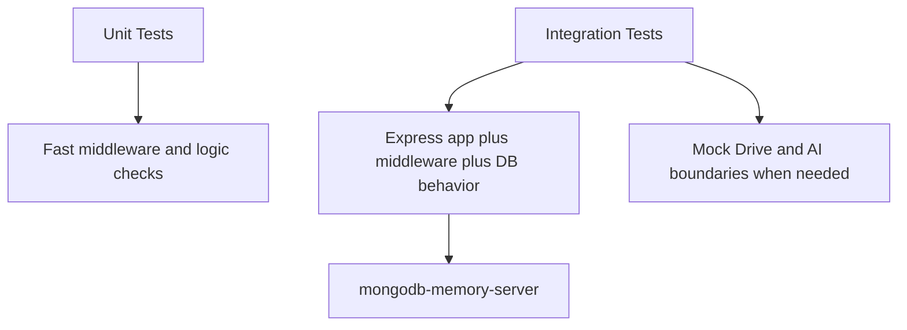
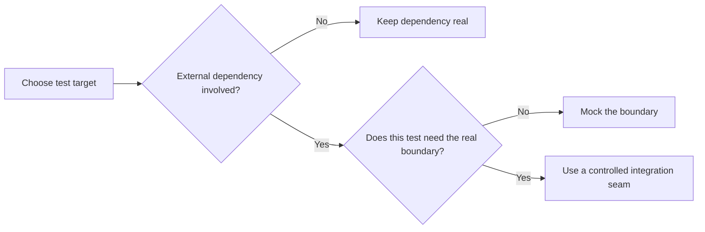

# ATSify Backend Testing Guide

This guide explains how the backend is tested today, what is intentionally mocked, and what quality checks should run before a release.

## Testing Strategy

The test suite follows a practical layered approach:

- unit tests for middleware and isolated logic
- integration tests for route behavior and response contracts
- mocked external boundaries for services that are slow, costly, or unstable in CI

## Testing Stack

| Tool | Role |
|---|---|
| Vitest | Test runner and mocking |
| Supertest | HTTP assertions against the Express app |
| mongodb-memory-server | Ephemeral MongoDB for integration tests |
| cross-env | Test environment variable wiring |

## Test Architecture



## Commands

Run from the backend root:

- `npm test`
- `npm run test:watch`
- `npm run test:unit`
- `npm run test:integration`
- `npm run test:coverage`
- `npm run build`

## Test Directory Structure

```text
tests/
  helpers/
  integration/
  setup/
  unit/
```

## What Should Stay Real

The suite should keep these layers real whenever possible:

- route wiring
- authentication middleware
- validation middleware
- controller-level response behavior
- MongoDB persistence logic

## What Should Be Mocked

External or environment-sensitive boundaries should usually be mocked:

- Google Drive reads and writes
- AI model calls
- OCR or PDF conversion when the test target is route behavior rather than extraction fidelity

## Boundary Mocking Policy



## Current Coverage Highlights

| Area | What is currently verified |
|---|---|
| Auth | Signup, duplicate signup, login, refresh-without-cookie |
| Resume | Auth protection, upload success, user-scoped listing, owner-only detail lookup |
| Job requests | Creation, validation failure, user-scoped listing, missing detail record |
| Analysis | Auth protection, validation failure, successful structured response |
| Admin | `401` for no token, `403` for non-admin, `200` for admin stats |
| Middleware | Auth middleware and validation middleware unit tests |

## Recommended Additional Coverage

To move closer to production-grade confidence, the next tests should cover:

1. Resume PDF streaming success and failure behavior.
2. Resume image streaming by page index.
3. Analysis history ordering and populated fields.
4. Latest-analysis lookup semantics per job request.
5. Specific-analysis lookup in user scope.
6. Admin user listing pagination and enrichment counts.
7. Role update behavior, including refresh token invalidation.
8. Failure paths for Drive upload, Drive streaming, and AI parsing.

## Example Integration Pattern

```ts
import request from "supertest";
import { describe, expect, it, vi } from "vitest";
import app from "../../../src/app";
import { setupIntegrationSuite } from "../../setup/integration";

setupIntegrationSuite();

vi.mock("../../../src/services/googleDrive.service", () => ({
  ensureUserDriveFolder: vi.fn().mockResolvedValue("folder-1"),
  uploadBufferToDrive: vi.fn().mockResolvedValue({ id: "file-1" }),
  downloadDriveFileBuffer: vi.fn(),
  getDriveFileStream: vi.fn(),
}));

describe("Resume routes", () => {
  it("rejects unauthenticated access", async () => {
    const response = await request(app).get("/api/v1/resume");
    expect(response.status).toBe(401);
  });
});
```

## Release Gate

Before merge or deployment, the minimum backend gate should be:

1. `npm run build`
2. `npm test`
3. `npm run test:integration`

Release readiness should also confirm:

- MongoDB connectivity is valid for the target environment
- Google Drive credentials are configured
- the configured Drive base folder is writable
- JWT secrets are present

## Documentation-to-Test Alignment

Because this repo currently uses multiple response envelope styles, tests are especially important. They are the safest guardrail to ensure the docs still match real behavior until the API becomes more standardized.
